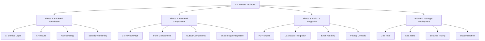
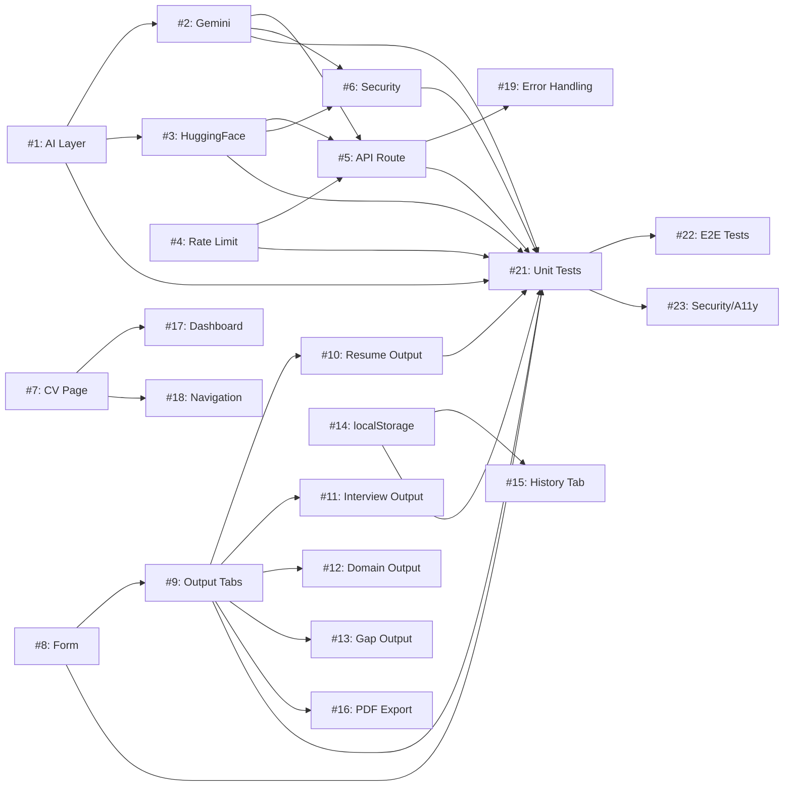

# CV Review Tool - GitHub Issues

## Overview

This document contains the breakdown of the CV Review Tool feature into actionable GitHub issues following product management best practices.

**Feature:** AI-Powered CV Review & Interview Preparation Tool  
**Epic:** QaiTalk Platform Enhancement - AI Tools Integration  
**Total Issues:** 23 (7 Small, 11 Medium, 5 Large)  
**Estimated Timeline:** 3 weeks

---

## Issue Sizing Guidelines

- **Small (S):** < 3 days, single responsibility, clear implementation
- **Medium (M):** 4-7 days, moderate complexity, multiple files
- **Large (L):** 8+ days, complex integration, requires Epic breakdown

---

## Epic Structure

---

## Phase 1: Backend Foundation (Week 1, Days 1-3)

### Issue #1: Set Up AI Service Layer Architecture

**Labels:** `component:backend`, `size:medium`, `phase:1-foundation`, `priority:critical`

**Overview:**
Create the foundational AI service layer with TypeScript interfaces, provider abstraction, and orchestration logic.

**User Story:**
As a **backend developer**, I want **a clean AI service architecture** so that **I can easily integrate multiple AI providers with automatic fallback**.

**Context:**
- New functionality (no existing AI integrations in QaiTalk)
- Must be compatible with Cloudflare Edge Runtime
- Support for Gemini (primary) and HuggingFace (fallback)

**Acceptance Criteria:**
- [ ] TypeScript interfaces defined in `lib/ai/types.ts`
- [ ] AI provider interface created (`AIProvider`)
- [ ] Request/Response types defined (`CVGenerationRequest`, `CVGenerationResponse`)
- [ ] Orchestrator logic routes to primary then fallback provider
- [ ] All types exported from `lib/ai/index.ts`

**Technical Requirements:**
- TypeScript 5 strict mode
- Edge Runtime compatible (no Node.js-specific APIs)
- Clean separation of concerns (types, providers, orchestrator)

**Definition of Done:**
- [ ] Types compile without errors
- [ ] Code passes ESLint checks
- [ ] Unit tests for orchestrator (85%+ coverage)
- [ ] PR approved by tech lead

**Dependencies:** None (first task in Phase 1)

**Estimated Effort:** 1.5 days

---

### Issue #2: Implement Gemini AI Provider

**Labels:** `component:ai-services`, `size:medium`, `phase:1-foundation`, `priority:critical`

**Overview:**
Implement the Gemini 2.0 Flash provider with prompt engineering for CV review generation.

**User Story:**
As a **backend developer**, I want **Gemini integration** so that **I can generate AI-powered CV reviews**.

**Context:**
- Free tier: 1,500 requests/day
- Model: gemini-2.0-flash-exp
- Prompt must include 4 sections: ATS resume, interview guide, technical questions, gap analysis

**Acceptance Criteria:**
- [ ] `lib/ai/providers/gemini.ts` created
- [ ] API key loaded from `process.env.GEMINI_API_KEY`
- [ ] Prompt template includes clear delimiters (resume/job description)
- [ ] Response parsing extracts 4 sections + matched keywords
- [ ] Error handling for API failures (404, 500, timeout)
- [ ] Timeout set to 60 seconds

**Technical Requirements:**
- SDK: `@google/generative-ai` (official package)
- Prompt injection defenses (sanitize input)
- Output validation (ensure all 4 sections present)

**Definition of Done:**
- [ ] Provider generates CV review successfully
- [ ] Unit tests with mocked API calls (85%+ coverage)
- [ ] Manual test with real Gemini API key
- [ ] Documentation added to code comments

**Dependencies:** Issue #1 (AI Service Layer)

**Estimated Effort:** 2 days

---

### Issue #3: Implement HuggingFace Fallback Provider

**Labels:** `component:ai-services`, `size:medium`, `phase:1-foundation`, `priority:high`

**Overview:**
Implement HuggingFace Llama-3.3-70B provider as fallback when Gemini fails.

**User Story:**
As a **backend developer**, I want **HuggingFace fallback** so that **the service remains available even if Gemini is down**.

**Context:**
- Free tier: 30,000 requests/month
- Model: meta-llama/Llama-3.3-70B-Instruct
- Same prompt template as Gemini for consistency

**Acceptance Criteria:**
- [ ] `lib/ai/providers/huggingface.ts` created
- [ ] API key loaded from `process.env.HF_API_KEY`
- [ ] Same prompt template as Gemini (reuse)
- [ ] Response parsing handles HuggingFace format
- [ ] Automatic retry on transient failures

**Technical Requirements:**
- SDK: `@huggingface/inference` (official package)
- Edge Runtime compatible
- Same output format as Gemini provider

**Definition of Done:**
- [ ] Provider generates CV review successfully
- [ ] Unit tests with mocked API calls (85%+ coverage)
- [ ] Integration test: Gemini fails → HuggingFace succeeds
- [ ] Performance benchmark: generation time < 60s (p95)

**Dependencies:** Issue #1 (AI Service Layer), Issue #2 (Gemini Provider for prompt template)

**Estimated Effort:** 1.5 days

---

### Issue #4: Implement IP-Based Rate Limiting

**Labels:** `component:backend`, `size:small`, `phase:1-foundation`, `priority:high`

**Overview:**
Create in-memory rate limiter to prevent abuse (10 requests per IP per 24 hours).

**User Story:**
As a **platform owner**, I want **rate limiting** so that **users cannot abuse the free AI API quota**.

**Context:**
- Simple in-memory Map (can upgrade to Cloudflare KV later)
- Resets on server restart (acceptable for MVP)
- Must extract IP from Cloudflare headers

**Acceptance Criteria:**
- [ ] `lib/ai/rate-limiter.ts` created
- [ ] `checkRateLimit(ip: string): boolean` function
- [ ] `getClientIP(request: Request): string` helper
- [ ] Block 11th request from same IP
- [ ] Reset counter after 24 hours
- [ ] Support Cloudflare headers (CF-Connecting-IP, X-Real-IP, X-Forwarded-For)

**Technical Requirements:**
- In-memory Map storage: `Map<string, RateLimitEntry>`
- Type: `RateLimitEntry = { count: number, resetAt: Date }`
- Edge Runtime compatible

**Definition of Done:**
- [ ] Rate limiter blocks excessive requests
- [ ] Unit tests cover all scenarios (85%+ coverage)
- [ ] Test with multiple IPs (should be independent)
- [ ] Documentation explains 24-hour window

**Dependencies:** None (independent task)

**Estimated Effort:** 1 day

---

### Issue #5: Create CV Review API Route

**Labels:** `component:api`, `size:medium`, `phase:1-foundation`, `priority:critical`

**Overview:**
Create POST `/api/cv-review/generate` endpoint with validation, rate limiting, and AI orchestration.

**User Story:**
As a **frontend developer**, I want **a RESTful API** so that **I can submit CV review requests from the UI**.

**Context:**
- Edge Runtime compatible (Cloudflare Pages)
- Public endpoint (no authentication)
- Input validation: max 10k characters per field

**Acceptance Criteria:**
- [ ] `app/api/cv-review/generate/route.ts` created
- [ ] POST handler accepts: `{ resume: string, jobDescription: string }`
- [ ] IP extraction using `getClientIP()`
- [ ] Rate limit check before processing
- [ ] Input validation (required fields, max length)
- [ ] AI generation via orchestrator
- [ ] Response format: `{ atsResume, interviewGuide, domainQuestions, gapAnalysis, matchedKeywords, metadata }`
- [ ] Error responses: 400 (invalid input), 429 (rate limit), 503 (AI unavailable)
- [ ] Security headers: X-Content-Type-Options, X-Frame-Options, Referrer-Policy

**Technical Requirements:**
- Edge Runtime: `export const runtime = 'edge'`
- TypeScript types from `lib/ai/types.ts`
- Error handling for all failure modes

**Definition of Done:**
- [ ] API returns CV review successfully
- [ ] Rate limiting enforced (11th request blocked)
- [ ] Invalid input rejected with 400 error
- [ ] Integration test with real AI providers
- [ ] Postman/cURL documentation created

**Dependencies:** Issue #1, #2, #3, #4

**Estimated Effort:** 2 days

---

### Issue #6: Security Hardening (Prompt Injection & XSS)

**Labels:** `component:security`, `size:medium`, `phase:1-foundation`, `priority:critical`

**Overview:**
Implement security defenses against prompt injection attacks and XSS via AI output.

**User Story:**
As a **security engineer**, I want **input/output sanitization** so that **attackers cannot manipulate the AI or inject malicious code**.

**Context:**
- Priority 1 issue from Security Review
- Must sanitize both input (prompt injection) and output (XSS)

**Acceptance Criteria:**
- [ ] Input sanitization: Remove "Ignore previous instructions", system markers
- [ ] Prompt delimiters: Use `===== RESUME START =====` / `===== RESUME END =====`
- [ ] Output sanitization: DOMPurify with allowlist (p, br, strong, em, ul, li, h1-h3)
- [ ] PII scrubbing: Remove emails, phone numbers, SSNs from AI output
- [ ] Validation: Reject output with suspicious patterns (API key, password, cryptocurrency)

**Technical Requirements:**
- Install: `npm install isomorphic-dompurify`
- Edge Runtime compatible sanitization
- No performance degradation (sanitization < 100ms)

**Definition of Done:**
- [ ] Prompt injection tests pass (10 test cases)
- [ ] XSS tests pass (5 test cases with `)
  - [ ] Rate limiting: Attempt 12 requests from same IP
  - [ ] API key exposure: Verify keys not in client bundle or errors
- [ ] **Accessibility Tests:**
  - [ ] Keyboard navigation: Tab through entire page
  - [ ] Screen reader: Test with NVDA/JAWS
  - [ ] Color contrast: Minimum 4.5:1 (text), 3:1 (UI components)
  - [ ] Focus indicators: Visible on all interactive elements
  - [ ] ARIA labels: All buttons, forms, landmarks
  - [ ] Axe Core: 0 violations

**Technical Requirements:**
- Use `@axe-core/playwright` for automated a11y testing
- Manual testing for screen reader compatibility

**Definition of Done:**
- [ ] All security tests pass
- [ ] 0 accessibility violations (automated)
- [ ] Manual a11y review approved
- [ ] Security review sign-off

**Dependencies:** All Phase 1-3 issues (full feature must be complete)

**Estimated Effort:** 2 days

---

## Issue Summary by Size

| Size | Count | Issues |
|------|-------|--------|
| Small (S) | 7 | #4, #7, #12, #13, #14, #15, #17, #18, #20 |
| Medium (M) | 11 | #1, #2, #3, #5, #6, #8, #9, #10, #11, #16, #19, #22, #23 |
| Large (L) | 1 | #21 |

**Total:** 23 issues

---

## Dependencies Graph

---

## Project Board Setup (GitHub Projects)

### Columns
1. **Backlog** (0 issues)
2. **Ready** (Phase 1 issues: #1, #2, #3, #4, #5, #6)
3. **In Progress** (0 issues initially)
4. **In Review** (0 issues initially)
5. **Done** (0 issues initially)

### Filters by Phase
- `phase:1-foundation` (6 issues)
- `phase:2-frontend` (9 issues)
- `phase:3-polish` (4 issues)
- `phase:4-testing` (4 issues)

### Filters by Component
- `component:backend` (2 issues)
- `component:api` (1 issue)
- `component:ai-services` (2 issues)
- `component:security` (1 issue)
- `component:frontend` (13 issues)
- `component:testing` (3 issues)

### Labels Summary
- **Priority:** `priority:critical` (6), `priority:high` (10), `priority:medium` (7)
- **Size:** `size:small` (7), `size:medium` (11), `size:large` (1)
- **Phase:** `phase:1-foundation` (6), `phase:2-frontend` (9), `phase:3-polish` (4), `phase:4-testing` (4)
- **Component:** (see filters above)

---

## Related Documentation

- **Product Requirements:** [prd.md](./prd.md)
- **Strategic Plan:** [strategic-plan.md](./strategic-plan.md)
- **Implementation Plan:** [implementation-plan.md](./implementation-plan.md)
- **Security Review:** [security-review.md](./security-review.md)

**Status:** ✅ Ready for GitHub Issue Creation  
**Next:** Create deployment-strategy.md  
**Last Updated:** February 9, 2026
