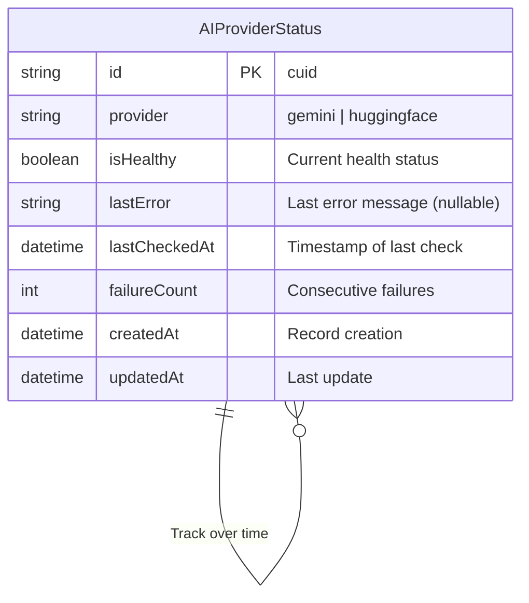
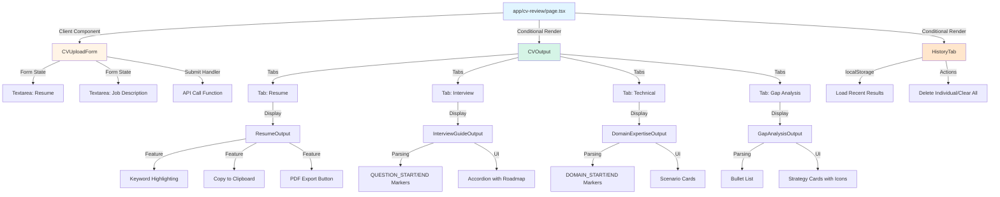
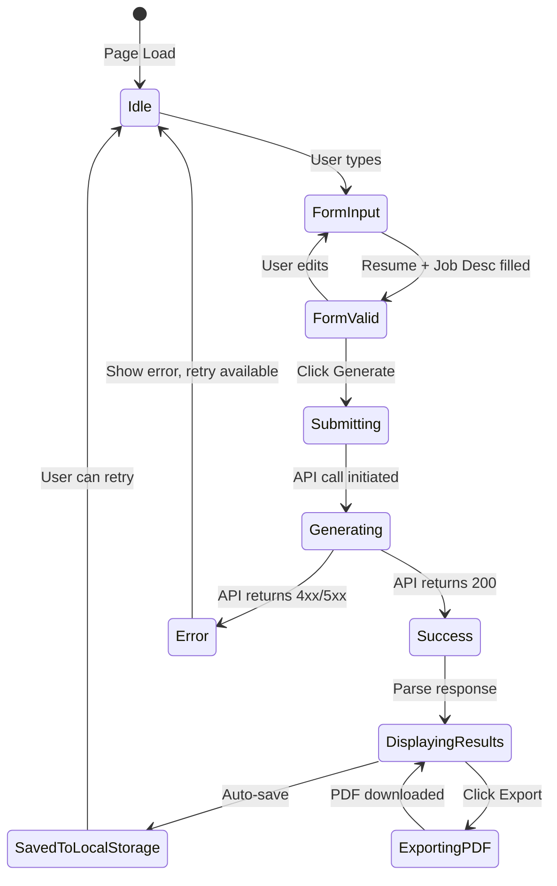

# CV Review Tool - Implementation Plan

## Overview

This document provides a comprehensive technical implementation plan for the AI-Powered CV Review & Interview Preparation Tool, following best practices for Next.js 16 App Router architecture.

**Feature Goal:** Privacy-first AI-powered CV review tool with ATS optimization, interview prep, technical questions, and gap analysis.

**Implementation Timeline:** 3 weeks  
**Risk Level:** Medium  
**Dependencies:** External AI APIs (Gemini, HuggingFace)

---

## File System

Folder and file structure following QaiTalk's Next.js monorepo:

```
next-app/
├── app/
│   ├── api/
│   │   └── cv-review/
│   │       └── generate/
│   │           └── route.ts              # Main API endpoint
│   ├── cv-review/
│   │   ├── page.tsx                      # Main CV review page
│   │   └── cv-review.css                 # PDF export styles
│   └── dashboard/
│       └── page.tsx                      # Update with CV tool card
├── components/
│   └── cv-review/
│       ├── CVUploadForm.tsx              # Resume + job desc inputs
│       ├── CVOutput.tsx                  # Tabbed results display
│       ├── ResumeOutput.tsx              # ATS-optimized resume
│       ├── InterviewGuideOutput.tsx      # STAR+ questions
│       ├── DomainExpertiseOutput.tsx     # Technical scenarios
│       └── GapAnalysisOutput.tsx         # Gap analysis + recommendations
├── lib/
│   ├── ai/
│   │   ├── types.ts                      # TypeScript interfaces
│   │   ├── index.ts                      # AI orchestrator
│   │   ├── rate-limiter.ts               # IP-based rate limiting
│   │   └── providers/
│   │       ├── gemini.ts                 # Gemini 2.0 Flash provider
│   │       └── huggingface.ts            # HuggingFace provider
│   ├── storage.ts                        # localStorage helpers
│   └── pdf-export.ts                     # PDF generation
├── prisma/
│   └── schema.prisma                     # Add AIProviderStatus model
└── package.json                          # Add dependencies
```

---

## Implementation Plan

### Goal

Build a privacy-first AI-powered CV review tool that generates ATS-optimized resumes, interview preparation guides, technical domain questions, and gap analysis without storing any user data server-side. Results are saved in the user's browser via localStorage, with multi-AI fallback (Gemini → HuggingFace) ensuring 99.9% uptime.

### Requirements

- Accept resume and job description inputs (max 10k characters each)
- Generate 4 outputs: ATS resume, interview questions (10 STAR+), technical scenarios (5-7), gap analysis
- Multi-AI fallback system (Gemini 2.0 Flash → HuggingFace Llama-3.3-70B)
- Client-side storage via localStorage (max 5 recent results)
- IP-based rate limiting (10 requests per IP per 24 hours)
- PDF export functionality
- No authentication required (public access)
- No server-side user data persistence
- WCAG 2.1 AA accessibility compliance
- Generation time < 60 seconds (p95)
- Mobile-responsive design

### Technical Considerations

#### System Architecture Overview

```mermaid
graph TB
    subgraph "Client Layer (Browser)"
        A[User] -->|1. Input Resume + Job Description| B[/cv-review Page]
        B -->|2. Submit Form| C[CVUploadForm Component]
        C -->|3. POST Request| D{API Route}
        B -->|Store Results| E[(localStorage)]
        B -->|Export| F[PDF Generator]
    end
    
    subgraph "API Layer (Edge Runtime)"
        D -->|4. Extract IP| G[Rate Limiter]
        G -->|5. Check Limit| H{Within Limit?}
        H -->|No| I[Return 429 Error]
        H -->|Yes| J[AI Orchestrator]
    end
    
    subgraph "Business Logic Layer"
        J -->|6. Try Primary| K[Gemini Provider]
        K -->|Success| L[Parse Response]
        K -->|Fail| M[HuggingFace Provider]
        M -->|Success| L
        M -->|Fail| N[Return 503 Error]
        L -->|7. Structured JSON| O[API Response]
    end
    
    subgraph "Data Layer"
        G -.->|In-Memory| P[(Rate Limit Map)]
        J -.->|Log Failures| Q[(Prisma: AIProviderStatus)]
    end
    
    subgraph "External Services"
        K -->|API Call| R[Google Gemini 2.0 Flash]
        M -->|API Call| S[HuggingFace Llama-3.3-70B]
    end
    
    O -->|8. Return JSON| B
    B -->|9. Display Results| T[CVOutput Components]
    
    style A fill:#e1f5ff
    style B fill:#fff4e6
    style D fill:#ffe6cc
    style J fill:#d5f4e6
    style K fill:#ffcccc
    style M fill:#ffcccc
    style E fill:#f0e6ff
    style Q fill:#f0e6ff
```

**Technology Stack Selection:**

| Layer | Technology | Rationale |
|-------|-----------|-----------|
| Frontend | Next.js 16 + React 19 | Already in use, App Router support |
| Styling | Tailwind CSS 3.4 | Existing design system, mobile-first |
| State | React useState + Zustand | Simple state for forms, Zustand for global |
| AI Primary | Google Gemini 2.0 Flash | Free tier 1,500 req/day, fast inference |
| AI Fallback | HuggingFace Llama-3.3-70B | Free tier 30k req/month, reliable |
| Storage | localStorage | Privacy-first, no backend needed |
| PDF | html2canvas + jspdf | Client-side, no backend processing |
| API Runtime | Edge Runtime | Cloudflare Pages compatible |
| Rate Limiting | In-memory Map | Simple, stateless (upgradable to Redis) |
| Database | Prisma + SQLite/D1 | Monitoring only (AIProviderStatus) |

**Integration Points:**
- Dashboard integration: Add CV tool card to `/app/dashboard/page.tsx`
- Navigation: Add link to `/components/layout/Header.tsx`
- API route: New `/app/api/cv-review/generate/route.ts`
- No breaking changes to existing features

**Deployment Architecture:**
- Cloudflare Pages (current staging environment)
- Edge runtime for API routes (serverless)
- Static site generation for CV review page
- Environment variables for API keys (server-side only)

**Scalability Considerations:**
- Horizontal scaling: Stateless API design (no session storage)
- Vertical scaling: Edge runtime handles 100+ concurrent users
- Rate limiting: In-memory Map (can upgrade to Cloudflare KV for distributed cache)
- AI capacity: 31,500+ daily CV generations (Gemini + HuggingFace combined)

#### Database Schema Design



**Table Specifications:**

```prisma
model AIProviderStatus {
  id           String   @id @default(cuid())
  provider     String   // "gemini" | "huggingface"
  isHealthy    Boolean  @default(true)
  lastError    String?  // Last error message for debugging
  lastCheckedAt DateTime @default(now())
  failureCount Int      @default(0) // Consecutive failures
  createdAt    DateTime @default(now())
  updatedAt    DateTime @updatedAt
  
  @@index([provider, lastCheckedAt])
}
```

**Indexing Strategy:**
- Composite index on `[provider, lastCheckedAt]` for fast health status queries
- No foreign keys (monitoring table, no relations)

**Database Migration Strategy:**
```bash
# Development
npx prisma migrate dev --name add_ai_provider_status

# Production
npx prisma migrate deploy
```

#### API Design

**Endpoint: POST /api/cv-review/generate**

```typescript
// Request
POST /api/cv-review/generate
Content-Type: application/json

{
  "resume": string,          // Max 10,000 characters
  "jobDescription": string   // Max 10,000 characters
}

// Success Response (200 OK)
{
  "atsResume": string,              // Keyword-matched resume (markdown)
  "interviewGuide": string,         // 10 STAR+ questions with markers
  "domainQuestions": string,        // 5-7 technical scenarios with markers
  "gapAnalysis": string,            // Gap analysis with recommendations
  "matchedKeywords": string[],      // Keywords from job description
  "metadata": {
    "provider": "gemini" | "huggingface",
    "generationTimeMs": number,
    "timestamp": Date
  }
}

// Error Responses
{
  "error": string,        // User-friendly message
  "code": string,         // ERROR_RATE_LIMIT | ERROR_AI_TIMEOUT | ERROR_INVALID_INPUT
  "retryable": boolean,   // Can retry immediately?
  "retryAfter"?: number   // Seconds (rate limit only)
}

// 400 Bad Request - Invalid input
{
  "error": "Resume and job description are required",
  "code": "ERROR_INVALID_INPUT",
  "retryable": true
}

// 429 Too Many Requests - Rate limit exceeded
{
  "error": "Daily limit reached. Try again tomorrow!",
  "code": "ERROR_RATE_LIMIT",
  "retryable": false,
  "retryAfter": 86400
}

// 503 Service Unavailable - All AI providers down
{
  "error": "Service temporarily unavailable. Please try again.",
  "code": "ERROR_AI_UNAVAILABLE",
  "retryable": true
}
```

**Authentication and Authorization:**
- No authentication required (public endpoint)
- Rate limiting via IP address (10 requests per IP per 24 hours)
- Stack Auth NOT used (feature is public)

**Error Handling Strategies:**
- Input validation: Reject requests with missing or oversized fields (400)
- Rate limiting: Auto-reject after 10 requests from same IP (429)
- AI timeout: 60-second timeout, retry once, fallback to secondary provider (503)
- Provider failure: Automatic silent fallback from Gemini → HuggingFace
- All errors logged to console (no sensitive data in logs)

**Rate Limiting:**
- Algorithm: Token bucket (10 tokens per IP per 24 hours)
- Storage: In-memory Map (resets on server restart - acceptable for MVP)
- Headers returned:
  ```
  X-RateLimit-Limit: 10
  X-RateLimit-Remaining: 7
  X-RateLimit-Reset: 1675958400 (Unix timestamp)
  ```

**Caching Strategies:**
- No caching (privacy-first: no request/response storage)
- Each generation is unique to user input

#### Frontend Architecture

##### Component Hierarchy Documentation



**Layout Structure:**

```tsx
// app/cv-review/page.tsx (Client Component)
'use client'

import { useState } from 'react'
import CVUploadForm from '@/components/cv-review/CVUploadForm'
import CVOutput from '@/components/cv-review/CVOutput'
import { saveResult, getResults, clearResult, clearAll } from '@/lib/storage'

export default function CVReviewPage() {
  const [activeTab, setActiveTab] = useState<'generate' | 'history'>('generate')
  const [loading, setLoading] = useState(false)
  const [outputs, setOutputs] = useState<CVGenerationResponse | null>(null)
  const [results, setResults] = useState<CVGenerationResponse[]>([])
  
  // ... component logic
  
  return (
    <div className="container mx-auto px-4 py-8">
      {/* Privacy Banner */}
      <div className="bg-blue-50 border border-blue-200 rounded-lg p-4 mb-6">
        <p className="text-sm text-blue-800">
          🔒 Your data stays in your browser. We don't store anything.
        </p>
      </div>
      
      {/* Tab Navigation */}
      <div className="flex gap-4 mb-6">
        <button onClick={() => setActiveTab('generate')}>Generate</button>
        <button onClick={() => setActiveTab('history')}>My Results</button>
      </div>
      
      {/* Content */}
      {activeTab === 'generate' ? (
        <>
          <CVUploadForm onSubmit={handleGenerate} loading={loading} />
          {outputs && <CVOutput data={outputs} />}
        </>
      ) : (
        <HistoryTab results={results} onDelete={handleDelete} />
      )}
    </div>
  )
}
```

**Component Details:**

```tsx
// components/cv-review/CVUploadForm.tsx
export default function CVUploadForm({ onSubmit, loading }) {
  return (
    <form onSubmit={handleSubmit} className="grid grid-cols-1 md:grid-cols-2 gap-4">
      {/* Resume Input */}
      <div>
        <label htmlFor="resume" className="block text-sm font-medium mb-2">
          Your Resume
        </label>
        <textarea
          id="resume"
          maxLength={10000}
          className="w-full h-64 border rounded-lg p-3"
          placeholder="Paste your resume here..."
        />
        <p className="text-sm text-gray-500 mt-1">
          {resume.length} / 10,000 characters
        </p>
      </div>
      
      {/* Job Description Input */}
      <div>
        <label htmlFor="jobDescription" className="block text-sm font-medium mb-2">
          Job Description
        </label>
        <textarea
          id="jobDescription"
          maxLength={10000}
          className="w-full h-64 border rounded-lg p-3"
          placeholder="Paste the target job description here..."
        />
        <p className="text-sm text-gray-500 mt-1">
          {jobDescription.length} / 10,000 characters
        </p>
      </div>
      
      {/* Submit Button */}
      <div className="md:col-span-2">
        <button
          type="submit"
          disabled={loading || !isValid}
          className="w-full bg-blue-600 text-white py-3 rounded-lg"
        >
          {loading ? 'Generating...' : 'Generate CV Review'}
        </button>
      </div>
    </form>
  )
}
```

```tsx
// components/cv-review/CVOutput.tsx
export default function CVOutput({ data }) {
  const [activeTab, setActiveTab] = useState('resume')
  
  return (
    <div className="mt-8">
      {/* Tab Headers */}
      <div className="flex border-b">
        <button onClick={() => setActiveTab('resume')}>ATS Resume</button>
        <button onClick={() => setActiveTab('interview')}>Interview Guide</button>
        <button onClick={() => setActiveTab('technical')}>Technical</button>
        <button onClick={() => setActiveTab('gap')}>Gap Analysis</button>
      </div>
      
      {/* Tab Content */}
      <div className="mt-6">
        {activeTab === 'resume' && <ResumeOutput content={data.atsResume} keywords={data.matchedKeywords} />}
        {activeTab === 'interview' && <InterviewGuideOutput content={data.interviewGuide} />}
        {activeTab === 'technical' && <DomainExpertiseOutput content={data.domainQuestions} />}
        {activeTab === 'gap' && <GapAnalysisOutput content={data.gapAnalysis} />}
      </div>
      
      {/* Actions */}
      <div className="mt-6 flex gap-4">
        <button onClick={exportPDF}>Export PDF</button>
        <button onClick={copyToClipboard}>Copy to Clipboard</button>
      </div>
    </div>
  )
}
```

**State Flow Diagram:**



**Reusable Component Library:**

```tsx
// components/cv-review/shared/Accordion.tsx
export function Accordion({ title, children, defaultOpen = false }) {
  const [isOpen, setIsOpen] = useState(defaultOpen)
  
  return (
    <div className="border rounded-lg mb-2">
      <button
        onClick={() => setIsOpen(!isOpen)}
        className="w-full flex items-center justify-between p-4"
      >
        <h3 className="font-medium">{title}</h3>
        <ChevronIcon className={isOpen ? 'rotate-180' : ''} />
      </button>
      {isOpen && <div className="p-4 border-t">{children}</div>}
    </div>
  )
}

// components/cv-review/shared/RoadmapLine.tsx
export function RoadmapLine({ currentStep, totalSteps }) {
  return (
    <div className="relative h-full w-1 bg-gray-200">
      <div
        className="absolute top-0 left-0 w-full bg-blue-600 transition-all"
        style={{ height: `${(currentStep / totalSteps) * 100}%` }}
      />
    </div>
  )
}

// components/cv-review/shared/KeywordHighlight.tsx
export function KeywordHighlight({ text, keywords }) {
  const highlighted = keywords.reduce((acc, keyword) => {
    const regex = new RegExp(`\\b${keyword}\\b`, 'gi')
    return acc.replace(regex, `<mark>$&</mark>`)
  }, text)
  
  return <span dangerouslySetInnerHTML={{ __html: DOMPurify.sanitize(highlighted) }} />
}
```

**State Management with Zustand:**

```typescript
// lib/stores/cvReviewStore.ts
import { create } from 'zustand'

interface CVReviewStore {
  results: CVGenerationResponse[]
  addResult: (result: CVGenerationResponse) => void
  deleteResult: (id: string) => void
  clearAll: () => void
  loadFromLocalStorage: () => void
}

export const useCVReviewStore = create<CVReviewStore>((set) => ({
  results: [],
  
  addResult: (result) => set((state) => {
    const newResults = [result, ...state.results].slice(0, 5) // Max 5
    localStorage.setItem('qaitalks-cv-results', JSON.stringify(newResults))
    return { results: newResults }
  }),
  
  deleteResult: (id) => set((state) => {
    const newResults = state.results.filter(r => r.id !== id)
    localStorage.setItem('qaitalks-cv-results', JSON.stringify(newResults))
    return { results: newResults }
  }),
  
  clearAll: () => {
    localStorage.removeItem('qaitalks-cv-results')
    set({ results: [] })
  },
  
  loadFromLocalStorage: () => {
    const stored = localStorage.getItem('qaitalks-cv-results')
    if (stored) {
      set({ results: JSON.parse(stored) })
    }
  }
}))
```

**TypeScript Interfaces:**

```typescript
// lib/ai/types.ts
export interface CVGenerationRequest {
  resume: string
  jobDescription: string
}

export interface CVGenerationResponse {
  id: string
  atsResume: string
  interviewGuide: string
  domainQuestions: string
  gapAnalysis: string
  matchedKeywords: string[]
  metadata: {
    provider: 'gemini' | 'huggingface'
    generationTimeMs: number
    timestamp: Date
  }
}

export interface AIProvider {
  name: string
  generate: (data: CVGenerationRequest) => Promise<CVGenerationResponse>
}

export interface RateLimitEntry {
  count: number
  resetAt: Date
}
```

##### Security & Performance

**Authentication/Authorization:**
- Public endpoint (no auth required per PRD)
- Rate limiting via IP address (primary abuse prevention)
- Input sanitization for XSS prevention

**Data Validation and Sanitization:**
```typescript
// Input validation
function validateInput(data: CVGenerationRequest): ValidationResult {
  if (!data.resume || !data.jobDescription) {
    return { valid: false, error: 'Resume and job description are required' }
  }
  
  if (data.resume.length > 10000 || data.jobDescription.length > 10000) {
    return { valid: false, error: 'Input exceeds maximum length (10,000 characters)' }
  }
  
  // Sanitize: Strip suspicious patterns
  const sanitizedResume = DOMPurify.sanitize(data.resume)
  const sanitizedJobDescription = DOMPurify.sanitize(data.jobDescription)
  
  return { valid: true, data: { resume: sanitizedResume, jobDescription: sanitizedJobDescription } }
}
```

**Performance Optimization:**
- Lazy loading: Code-split CV review page (dynamic import)
- Image optimization: Use Next.js Image component for any images
- Bundle size: Tree-shake unused AI SDK methods
- Memoization: useMemo for expensive computations (keyword matching)
- Debouncing: Character counters debounced to 300ms

**Caching Mechanisms:**
- No caching (privacy-first design)
- Each generation unique to user input
- localStorage acts as client-side cache for user's own results only

---

## Implementation Phases

### Phase 1: Backend Foundation (Week 1, Days 1-3)

**Goal:** AI service layer + API route + rate limiting

**Files to Create:**
```
lib/ai/types.ts
lib/ai/providers/gemini.ts
lib/ai/providers/huggingface.ts
lib/ai/index.ts
lib/ai/rate-limiter.ts
app/api/cv-review/generate/route.ts
```

**Key Tasks:**
1. Install dependencies: `npm install @google/generative-ai @huggingface/inference`
2. Create TypeScript interfaces
3. Implement Gemini provider (port from QAi-CV-Tool)
4. Implement HuggingFace fallback provider
5. Test providers on Cloudflare Workers Edge runtime
6. Build orchestrator with automatic fallback logic
7. Implement in-memory rate limiter (IP-based)
8. Create API route with validation + rate limiting

**Acceptance Criteria:**
- [ ] Gemini provider returns CV generation
- [ ] HuggingFace fallback triggers on Gemini failure
- [ ] Rate limiter blocks 11th request from same IP
- [ ] API route returns structured JSON response
- [ ] All unit tests pass (85%+ coverage)

### Phase 2: Frontend Components (Week 1 Day 4 - Week 2 Day 2)

**Goal:** UI components + localStorage integration

**Files to Create:**
```
app/cv-review/page.tsx
components/cv-review/CVUploadForm.tsx
components/cv-review/CVOutput.tsx
components/cv-review/ResumeOutput.tsx
components/cv-review/InterviewGuideOutput.tsx
components/cv-review/DomainExpertiseOutput.tsx
components/cv-review/GapAnalysisOutput.tsx
lib/storage.ts
```

**Key Tasks:**
1. Create CV review page (client component)
2. Build upload form with character counters
3. Implement tab navigation for outputs
4. Port ResumeOutput with keyword highlighting
5. Port InterviewGuideOutput with accordion
6. Port DomainExpertiseOutput with scenarios
7. Port GapAnalysisOutput with strategy cards
8. Implement localStorage helpers (save, load, delete)
9. Add "My Results" history tab

**Acceptance Criteria:**
- [ ] Form accepts input and validates
- [ ] All 4 output components render correctly
- [ ] Results auto-save to localStorage
- [ ] Max 5 results enforced (FIFO)
- [ ] Mobile responsive (375px, 768px, 1024px)

### Phase 3: Polish & Integration (Week 2, Days 3-5)

**Goal:** PDF export + dashboard integration + error handling

**Files to Create/Modify:**
```
lib/pdf-export.ts
app/cv-review/cv-review.css (PDF styles)
app/dashboard/page.tsx (add CV tool card)
components/layout/Header.tsx (add nav link)
```

**Key Tasks:**
1. Install PDF dependencies: `npm install html2canvas jspdf react-hot-toast`
2. Implement PDF export functionality
3. Add PDF-specific CSS classes
4. Update dashboard with "Try CV Review Tool" card
5. Add CV Review link to navigation header
6. Add privacy banner to CV review page
7. Implement comprehensive error handling
8. Add toast notifications (react-hot-toast)
9. Test all error paths (rate limit, AI timeout, invalid input)

**Acceptance Criteria:**
- [ ] PDF exports with professional formatting
- [ ] Dashboard integration complete
- [ ] Navigation link works
- [ ] All error states show user-friendly messages
- [ ] Toast notifications work

### Phase 4: Testing & Documentation (Week 3)

**Goal:** Comprehensive testing + deployment readiness

**Files to Create:**
```
__tests__/lib/ai/index.test.ts
__tests__/components/cv-review/CVUploadForm.test.tsx
e2e/cv-review.spec.ts
docs/cv-review-api.md
```

**Key Tasks:**
1. Write unit tests for AI service layer
2. Write component tests (Jest + React Testing Library)
3. Write E2E tests (Playwright) for full flow
4. Accessibility audit (WCAG 2.1 AA)
5. Load testing (100 concurrent users)
6. Security review
7. Update documentation (README, API docs)
8. Test on Cloudflare Pages staging
9. Create rollout plan

**Acceptance Criteria:**
- [ ] 85%+ test coverage
- [ ] All E2E tests pass
- [ ] WCAG 2.1 AA compliance verified
- [ ] Load test successful (100 users)
- [ ] Security review sign-off
- [ ] Staging deployment successful

---

## Dependencies & Blockers

**Critical Dependencies:**
- Google Gemini API key (from aistudio.google.com/apikey)
- HuggingFace API key (from huggingface.co/settings/tokens)
- Cloudflare Pages staging environment access
- Security review approval

**Potential Blockers:**
1. **Edge Runtime Incompatibility:** If AI SDKs don't work on Edge runtime
   - **Mitigation:** Test on Day 1, pivot to Node.js runtime (Vercel) if needed
2. **AI Quota Exhaustion:** If usage exceeds free tier limits
   - **Mitigation:** Rate limiting (10/IP/day), multi-provider fallback
3. **Generation Timeout:** If AI takes >60s consistently
   - **Mitigation:** Optimize prompts, increase timeout to 90s, better loading UX

---

## Testing Strategy

### Unit Tests (Jest)

```typescript
// __tests__/lib/ai/index.test.ts
describe('AI Orchestrator', () => {
  it('should use Gemini as primary provider', async () => {
    const result = await generateCVPackage(mockRequest)
    expect(result.metadata.provider).toBe('gemini')
  })
  
  it('should fallback to HuggingFace on Gemini failure', async () => {
    // Mock Gemini failure
    jest.spyOn(geminiProvider, 'generate').mockRejectedValue(new Error('API error'))
    
    const result = await generateCVPackage(mockRequest)
    expect(result.metadata.provider).toBe('huggingface')
  })
  
  it('should throw error if all providers fail', async () => {
    // Mock all providers failing
    await expect(generateCVPackage(mockRequest)).rejects.toThrow('All AI providers failed')
  })
})

// __tests__/lib/ai/rate-limiter.test.ts
describe('Rate Limiter', () => {
  it('should allow first 10 requests', () => {
    for (let i = 0; i < 10; i++) {
      expect(checkRateLimit('192.168.1.1')).toBe(true)
    }
  })
  
  it('should block 11th request', () => {
    for (let i = 0; i < 10; i++) {
      checkRateLimit('192.168.1.1')
    }
    expect(checkRateLimit('192.168.1.1')).toBe(false)
  })
  
  it('should reset after 24 hours', () => {
    // ... test with mocked Date
  })
})
```

### Integration Tests (Playwright)

```typescript
// e2e/cv-review.spec.ts
import { test, expect } from '@playwright/test'

test.describe('CV Review Tool', () => {
  test('should generate CV review successfully', async ({ page }) => {
    await page.goto('/cv-review')
    
    // Fill form
    await page.fill('[name="resume"]', 'Sample resume text...')
    await page.fill('[name="jobDescription"]', 'Sample job description...')
    
    // Submit
    await page.click('button[type="submit"]')
    
    // Wait for generation
    await page.waitForSelector('.cv-output', { timeout: 60000 })
    
    // Verify all sections present
    await expect(page.locator('.ats-resume')).toBeVisible()
    await expect(page.locator('.interview-guide')).toBeVisible()
    await expect(page.locator('.domain-questions')).toBeVisible()
    await expect(page.locator('.gap-analysis')).toBeVisible()
  })
  
  test('should save to localStorage', async ({ page }) => {
    // ... test localStorage persistence
  })
  
  test('should export PDF', async ({ page }) => {
    // ... test PDF download
  })
  
  test('should handle rate limiting', async ({ page }) => {
    // Make 11 requests from same IP
    // Verify 11th shows error message
  })
})
```

### Accessibility Testing

```typescript
// e2e/cv-review-a11y.spec.ts
import { test, expect } from '@playwright/test'
import AxeBuilder from '@axe-core/playwright'

test('should have no accessibility violations', async ({ page }) => {
  await page.goto('/cv-review')
  
  const accessibilityScanResults = await new AxeBuilder({ page })
    .withTags(['wcag2a', 'wcag2aa'])
    .analyze()
  
  expect(accessibilityScanResults.violations).toEqual([])
})
```

---

## Deployment Plan

### Environment Variables

```bash
# .env.local (development)
DATABASE_URL="file:./dev.db"
GEMINI_API_KEY="your-gemini-api-key"
HF_API_KEY="your-huggingface-api-key"
AI_PRIMARY_PROVIDER="gemini"
AI_FALLBACK_PROVIDER="huggingface"
AI_TIMEOUT_MS="60000"
RATE_LIMIT_PER_IP="10"

# Cloudflare Pages (production)
# Set via dashboard: Settings > Environment Variables
GEMINI_API_KEY=***
HF_API_KEY=***
AI_PRIMARY_PROVIDER=gemini
AI_FALLBACK_PROVIDER=huggingface
AI_TIMEOUT_MS=60000
RATE_LIMIT_PER_IP=10
```

### Build Commands

```bash
# Development
npm run dev

# Type check
npm run type-check

# Tests
npm run test
npm run test:e2e

# Production build
npm run build

# Cloudflare Pages build
npm run build:cloudflare
```

### Deployment Checklist

- [ ] Environment variables configured in Cloudflare Pages
- [ ] API keys validated and working
- [ ] Database migrations run (`npx prisma migrate deploy`)
- [ ] Build successful locally
- [ ] All tests passing
- [ ] Security review complete
- [ ] Staging deployment successful
- [ ] Monitoring dashboards configured
- [ ] Rollback plan documented

---

## Success Metrics

**Technical Metrics:**
- API response time (p95): < 60 seconds
- Error rate: < 5%
- Uptime: 99.9% (with multi-AI fallback)
- Test coverage: > 85%
- Accessibility: WCAG 2.1 AA compliant

**Business Metrics:**
- Week 1: 50+ CV generations
- Month 1: 500+ unique users
- Month 3: 2,000+ monthly active users
- User satisfaction: 4.0+ / 5.0 (if survey added)

---

## Related Documentation

- **Product Requirements:** [prd.md](./prd.md)
- **Strategic Plan:** [strategic-plan.md](./strategic-plan.md)
- **Security Review:** [security-review.md](./security-review.md)
- **GitHub Issues:** See issues tagged `cv-review-tool`, `phase-1-mvp`
- **Deployment Strategy:** [deployment-strategy.md](./deployment-strategy.md)

---

**Status:** ✅ Ready for Implementation  
**Next:** Create security-review.md and GitHub issues  
**Last Updated:** February 9, 2026
